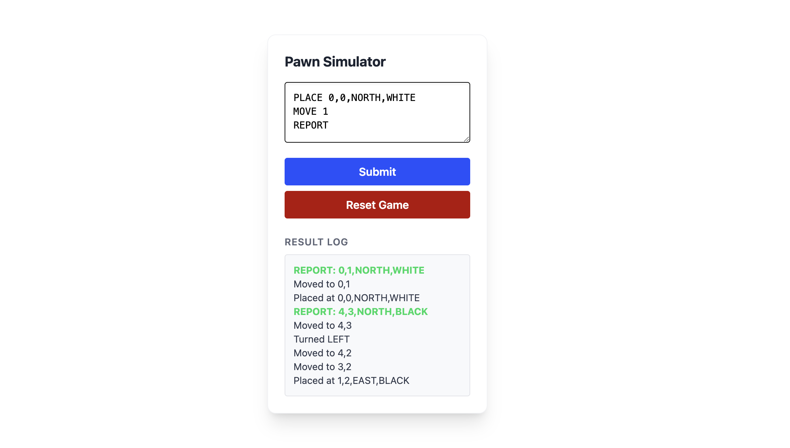

# WeGuide - Coding Challenge

## The Pawn Simulator

A Ruby on Rails 8 application that simulates a chess pawn moving on an 8x8 chess board.

## Getting Started

### Prerequisites
- Ruby 3.4.1
- SQLite3
- Bundler

### Installation

1. Install gems
```bash
  bundle install
```

2. Setup Database

```bash
rails db:create db:migrate
```

3. Start dev server
```bash
  ./bin/dev
```

`bin/dev` because to build TailwindCSS classes.

4. Visit Application `http://localhost:3000`

### Application UI



### Running Commands Example
**Single commands**
```
PLACE 0,0,NORTH,WHITE
```

**Multi-line commands**
```
PLACE 3,3,EAST,BLACK
MOVE 2
RIGHT
MOVE 1
REPORT

PLACE 0,0,NORTH,BLACK
LEFT
REPORT
```

**Result Log Feedback**
- Each latest Report is shown on the top of scrollable div.
- Other Command entries follows the REPORT result.

## Running Tests
```bash
  # entire test suite
  bundle exec rspec

  # specific tests
  bundle exec rspec spec/services/pawn_game_service_spec.rb
  bundle exec rspec spec/domain/pawn_spec.rb
  bundle exec rspec spec/domain/board_spec.rb
```
### Test coverage includes:
- Valid and invalid PLACE commands
- First move vs subsequent moves
- Rotation logic (LEFT/RIGHT)
- Boundary protection
- Command normalization (case, whitespace)
- Commands before initial PLACE are ignored


## Test Data

**Full board movement**

```
PLACE 0,3,EAST,WHITE
MOVE 2
MOVE 1
MOVE 1
MOVE 1
MOVE 1
MOVE 1
MOVE 1
REPORT
```

- Output: `7,3,EAST,WHITE`

**Multiple Rotations**

```
PLACE 3,3,NORTH,WHITE
RIGHT
RIGHT
RIGHT
RIGHT
REPORT
```

- Output: `3,3,NORTH,WHITE`

**First Valid Moves - 2 steps**

```
PLACE 4,4,WEST,BLACK
MOVE 2
REPORT
```

- Output: `2,4,WEST,BLACK`

**First Invalid Moves - 5 steps**

```
PLACE 2,2,EAST,WHITE
MOVE 5
REPORT
```

- Output: `4,2,EAST,WHITE`

**Subsequent Move - 1 step**

```
PLACE 2,2,EAST,BLACK
MOVE 1
MOVE 2
REPORT
```

- Output: `4,2,EAST,BLACK`

**Multiple PLACE commands**

```
PLACE 0,0,NORTH,WHITE
MOVE 2
REPORT
PLACE 7,7,SOUTH,BLACK
REPORT
```

- Output1: `0,2,NORTH,WHITE`
- Output2: `7,7,SOUTH,BLACK`

**Invalid PLACE command (Out of bounds)**

```
PLACE 8,8,NORTH,WHITE
REPORT
PLACE 3,3,EAST,BLACK
REPORT
```

- Output1: pawn not placed, out of bound
- Output2: `3,3,EAST,BLACK`

**Commands before PLACE are ignroed**

```
MOVE
LEFT
RIGHT
REPORT
PLACE 2,2,SOUTH,WHITE
REPORT
```

- Output: `2,2,SOUTH,WHITE`


